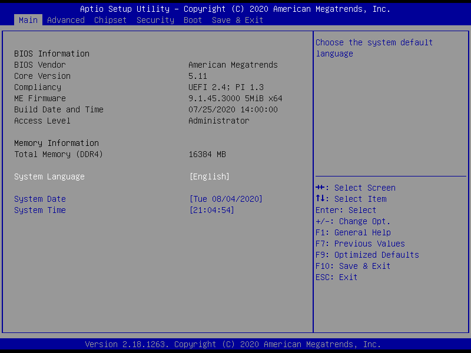
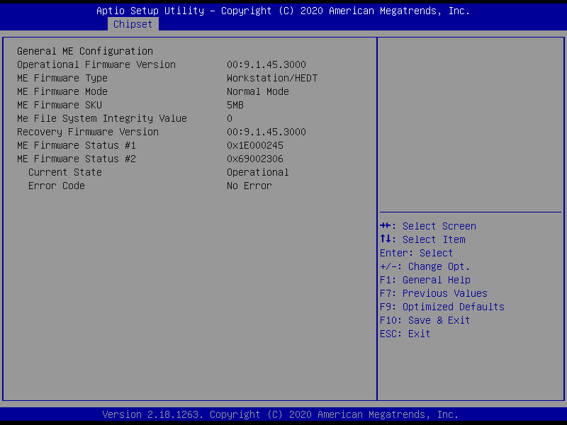

# HUANANZHI X99-F8 GAMING

## CX99DE25 BIOS for HUANANZHI X99-F8 GAMING Motherboard 07/25/2020
  

  Builder: iEngineer

  Manufacturer Bug Fixed, Latest updates, set FSB 100MHz

  Update:
1) ME Firmware (latest) version 9.1.45.3000 (5MiB).

2) EFI/OROM for RSTe SATA(Port 0-3)/sSATA(Port 4-7) firmware up to 5.5.5.1005 ((latest) Full I/O speed).
3) CPU microcode (latest).
4) AMI NVMe firmware (latest).
5) DMI Data.

  Deleted:
1) All trash (Unrelated to Huananzhi X99-F8).
2) LAN BOOT ROM.

  Added:
1) EFI Shell.

  Looked:
MBEx, Cipher Transport Layer TLS (CVE-2017-5689 & CVE-2018-3616), PTT, NFC, RPAT, AMT.

  Changes:
1) Enable DUAL/QUAD SPI for Winbond 25Q128FVSG & 25Q128JVSQ.
2) Changes Master Acces from Debug/Manufacturing to Production.
3) Increased BBBS up to 1MiB.
4) WCOD ID 0x0082 TAYLOR.
5) Permanently disabled Intel AMT.
6) Permanently disabled Intel ME Network Service.
7) Hidden BIOS items that do not control.

  How to update Firmware:
1) Burn the Firmware to programmer device. (e.g. EZP-2019)
2) Clear CMOS.
3) After restart go to the BIOS setting & use 'Restore Default' / 'F10' / 'Enter'
4) Configure RAM timings & enjoy.

Addon: 7BB28B99-61BB-11D5-9A5D-0090273FC14D.FFS

  How to install:
1) Open BIOS file in UEFITool
2) Find (Ctrl+F) GUID 7BB28B99-61BB-11D5-9A5D-0090273FC14D then select (Ctrl+R) Replace as is (choise new downloaded  7BB28B99-61BB-11D5-9A5D-0090273FC14D.FFS file).
3) File (Ctrl+S) Save image file.
